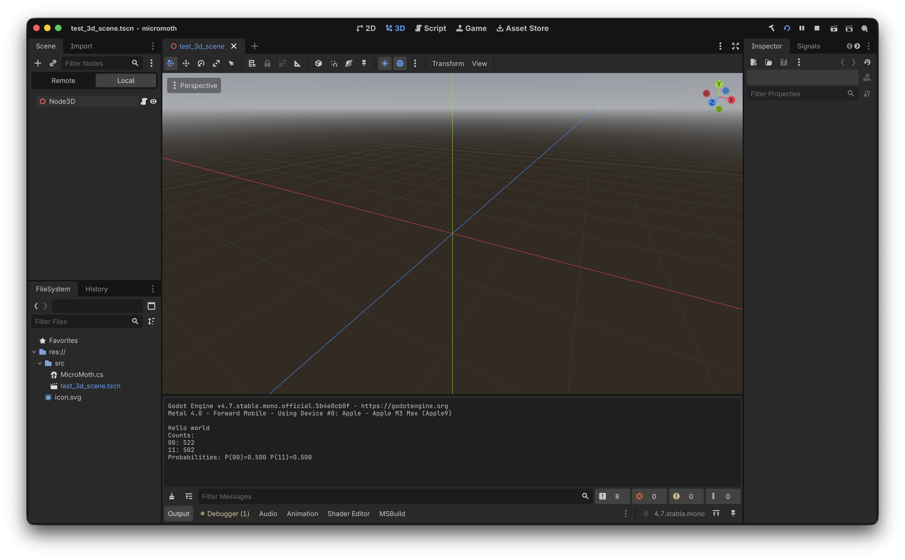

# MicroMoth for C#
This version of MicroMoth is for development that mainly uses C#, such as a game development on Godot and Unity. Of course, it supports other purposes, too.

## Setup
This library is released under [NuGet](https://www.nuget.org), the package manager for `.NET`. You can view MicroMoth (the official, packaged name is `Moth.MicroMoth`) in [NuGet gallery](https://www.nuget.org/profiles/astryd-moth).

Start using it from the 1.0.1 version, because it contains the important bug fix for solving the roman name conflict issue within Godot if someone made their game project named as 'micromoth' and tries to import `MicroMoth` package. Other than that, there is no difference between v1.0.0 and v1.0.1.

### Godot (.NET version)
Open up the Godot CLI and type:
``` bash
dotnet add package Moth.MicroMoth
```

It will automatically add the MicroMoth package and add these lines underneath your `.csproj` of the game.
```
<ItemGroup>
    <PackageReference Include="Moth.MicroMoth" Version="1.0.1" />
</ItemGroup>
```

If you look at the [Example](example_godot/micromoth/), there is an example for Godot to print out the result from the simple phi-plus Bell state. It will print out something like this if you compile the game execute the script.



### Unity
Drag and drop the `MicroMoth.cs` file in your game project, similar with any other MicroMoth versions. It's the standalone library file, so there should be no issue to create the new class, import the functions and have fun!

## Furthermore...
There is the interesting library that can be used in C# projects powered by `MicroMothCsharp`, so stay tuned!